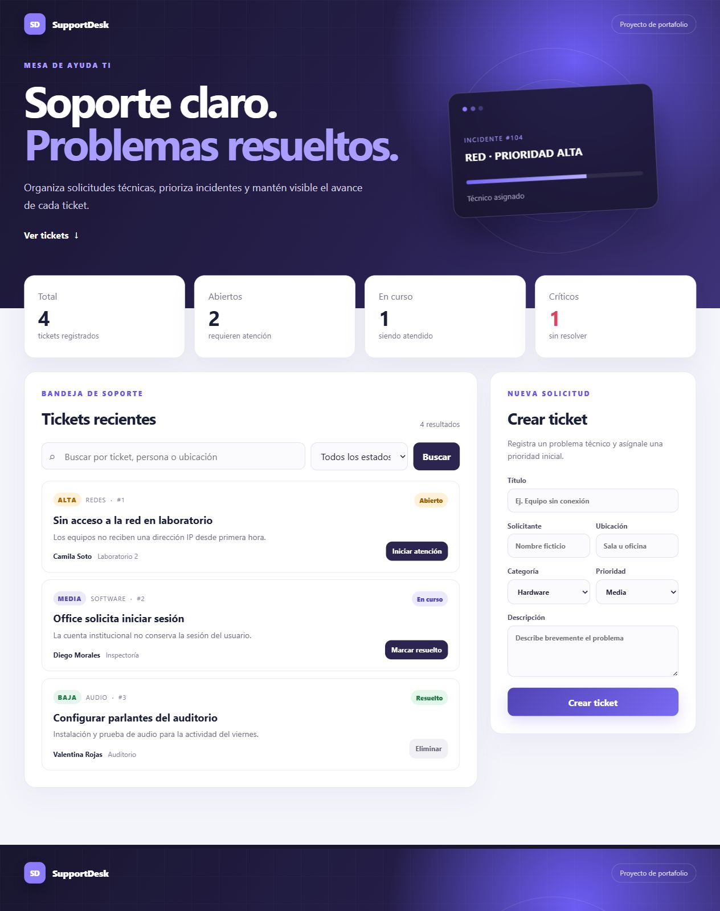

# SupportDesk

Mesa de ayuda TI para registrar, priorizar y seguir incidentes técnicos. El proyecto representa un flujo de soporte de nivel 1 y está pensado como demostración de portafolio full stack.

[Ver demo en vivo](https://pietroalvarez-supportdesk-demo.onrender.com)



## Funcionalidades

- Panel con indicadores de tickets abiertos, en progreso, resueltos y críticos.
- Registro de solicitudes con responsable, ubicación, categoría y prioridad.
- Búsqueda por texto y filtro por estado.
- Avance controlado del flujo: abierto → en progreso → resuelto.
- Eliminación de tickets y actualización automática del panel.
- Datos de demostración cargados al iniciar, sin configuración previa.
- Perfil PostgreSQL incluido para persistencia real.

## Tecnologías

- Java 21 y Spring Boot 3
- API REST, Spring Data JPA y validaciones
- Angular 22, TypeScript, HTML y SCSS
- PostgreSQL 17 para persistencia
- H2 en memoria para una demostración inmediata
- Maven, npm y Docker Compose

## Arquitectura

```text
Angular (localhost:4201)
        │ HTTP / JSON
        ▼
Spring Boot API (localhost:8081)
        │ JPA
        ▼
H2 local o PostgreSQL
```

## Ejecución rápida

Requisitos: Java 21, Maven, Node.js 22 o superior y npm.

1. Inicia la API:

   ```bash
   cd backend
   mvn spring-boot:run
   ```

2. En otra terminal, inicia Angular:

   ```bash
   cd frontend
   npm install
   npm start
   ```

3. Abre `http://localhost:4201`.

La configuración predeterminada usa H2 y carga información ficticia. No necesitas instalar una base de datos para probar el proyecto.

## Uso con PostgreSQL

```bash
docker compose up -d
cd backend
mvn spring-boot:run -Dspring-boot.run.profiles=postgres
```

PostgreSQL queda disponible en el puerto `5432`. Las credenciales locales de demostración se encuentran en `docker-compose.yml` y pueden reemplazarse mediante las variables `DATABASE_URL`, `DATABASE_USERNAME` y `DATABASE_PASSWORD`.

## API REST

| Método | Ruta | Acción |
| --- | --- | --- |
| GET | `/api/dashboard` | Obtiene indicadores del panel |
| GET | `/api/tickets` | Lista y filtra tickets |
| POST | `/api/tickets` | Crea un ticket |
| PUT | `/api/tickets/{id}` | Actualiza un ticket |
| PATCH | `/api/tickets/{id}/advance` | Avanza su estado |
| DELETE | `/api/tickets/{id}` | Elimina un ticket |

## Pruebas

```bash
cd backend
mvn test
```

El frontend también se valida con el compilador estricto de Angular y TypeScript.

## Despliegue

El `Dockerfile` compila Angular, lo integra dentro de Spring Boot y genera un único servicio web. `render.yaml` permite desplegarlo en Render y volver a publicarlo automáticamente con cada cambio en `main`.

[](https://render.com/deploy?repo=https://github.com/PietroAlvarez/SupportDesk)

## Autor

Desarrollado por [Pietro Alvarez](https://www.linkedin.com/in/pietro-antonello-francesco-alvarez-gazzola-33280438/).

Los nombres y registros incluidos son ficticios y se utilizan únicamente para demostración.
